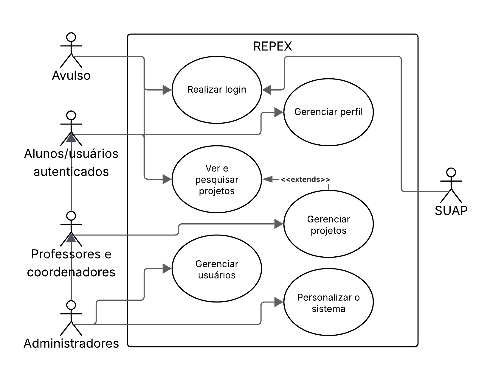
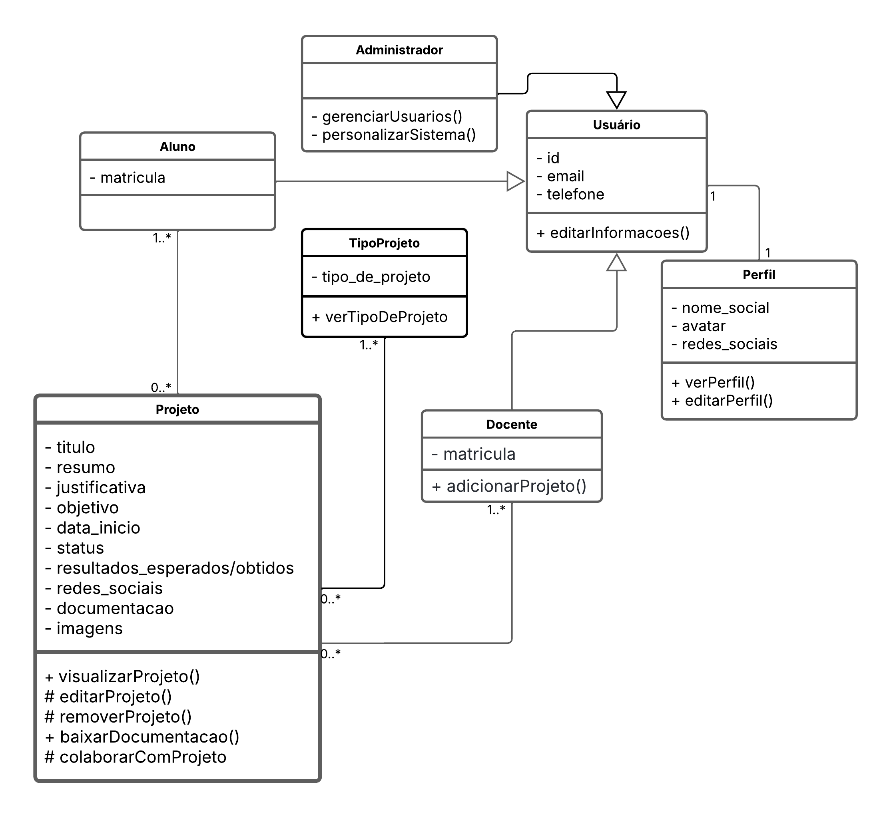
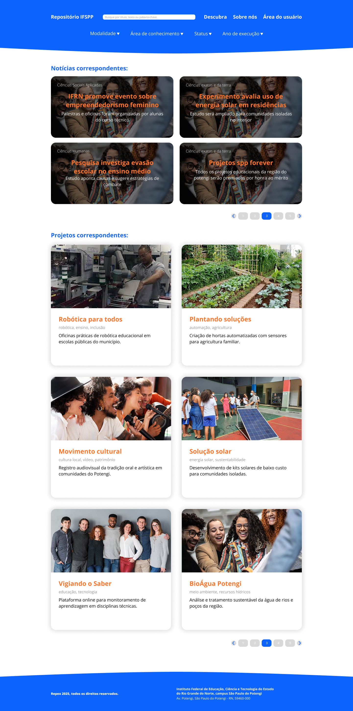
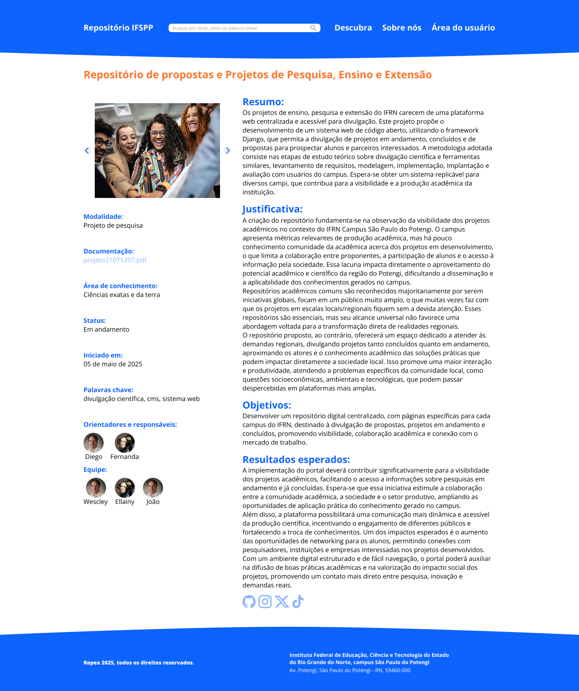
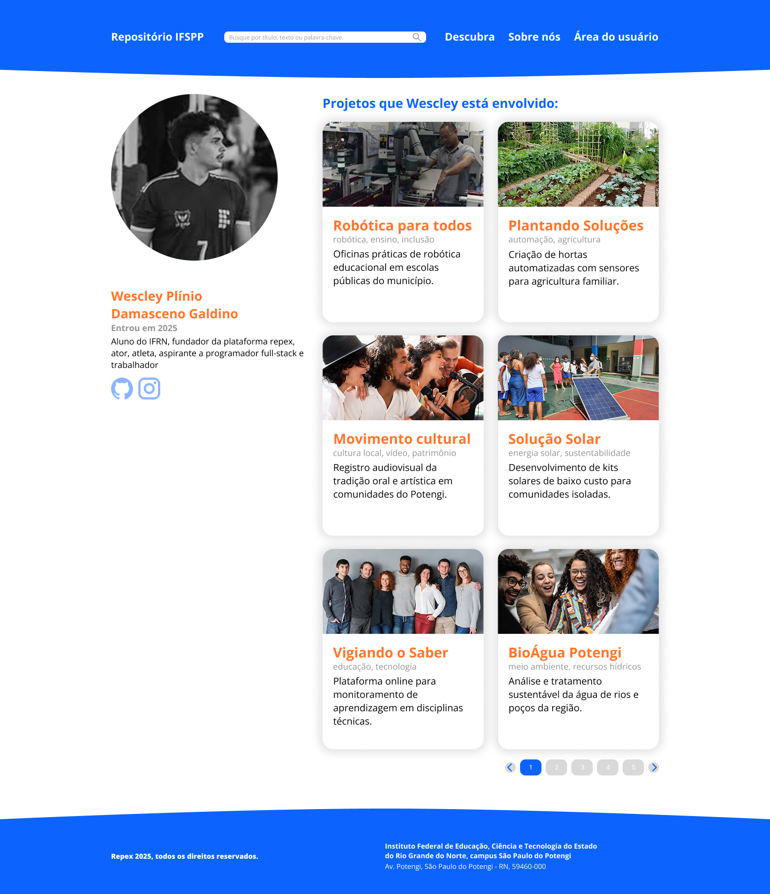
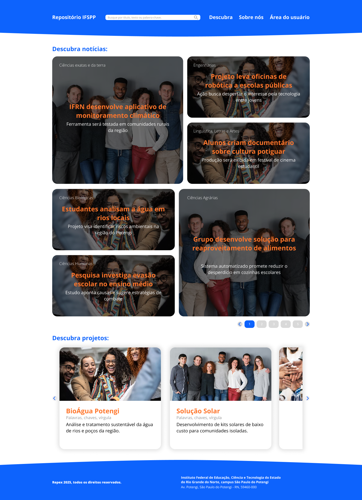

# Repositório de Propostas e projetos de Ensino, Pesquisa e Extensão - REPEX

## Sumário
- [Resumo](#resumo)
- [Palavras chave](#palavras-chave)
- [Introdução](#introdução)
- [Justificativa](#justificativa)
- [Fundamentação teórica](#fundamentção-teórica)
- [Objetivo geral](#objetivo-geral)
- [Resultados esperados](#resultados-esperados)
- [Diagrama de Classes](#diagrama-de-classes)
- [Análise e projeto do sistema](#análise-e-projeto-do-sistema)
- [Requisitos funcionais](#requisitos-funcionais)
- [Requisitos não-funcionais](#requisitos-não-funcionais)
- [Diagrama de casos de uso](#diagrama-de-casos-de-uso)
- [Diagrama de classes](#diagrama-de-classes)
- [Protótipos de tela](#protótipos-de-tela-alta-fidelidade)
- [Referências bibliográficas](#referências-bibliográficas)

## Resumo:
Os projetos de ensino, pesquisa e extensão do IFRN carecem de uma plataforma web centralizada e acessível para divulgação. Este projeto propõe o desenvolvimento de um sistema web de código aberto, utilizando o framework Django, que permita a divulgação de projetos em andamento, concluídos e de propostas para prospectar alunos e parceiros interessados. A metodologia adotada consiste nas etapas de estudo teórico sobre divulgação científica e ferramentas similares, levantamento de requisitos, modelagem, implementação, implantação e avaliação com usuários do campus. Espera-se obter um sistema replicável para diversos campi, que contribua para a visibilidade e a produção acadêmica da instituição.

## Palavras chave:
    divulgação científica, cms, sistema web

## Introdução:
No IFRN, uma variedade de projetos de pesquisa, ensino e extensão é continuamente desenvolvida, contribuindo para a produção científica e o fortalecimento da relação entre a instituição e a comunidade. No entanto, observa-se que grande parte dessas iniciativas não alcança plenamente o público que poderia participar ou se beneficiar dos resultados produzidos. Muitos projetos permanecem restritos a arquivos físicos ou digitais de difícil acesso, o que limita sua visibilidade e a possibilidade de colaboração. Essa situação dificulta a integração entre proponentes, estudantes e demais interessados, restringindo o impacto das atividades acadêmicas na sociedade.

A presente proposta busca enfrentar essa problemática por meio do desenvolvimento de um repositório digital voltado à divulgação de ideias e projetos. Diferentemente de plataformas voltadas apenas para resultados consolidados, como o Memoria IFRN e o portal Integra IFRN, o sistema proposto se dedica à apresentação de projetos em andamento e de propostas em fase de captação de colaboradores. A plataforma permitirá a integração entre proponentes e alunos, com foco na valorização das iniciativas locais de cada campus, favorecendo a interação entre os membros da comunidade acadêmica e ampliando a participação da sociedade nas atividades institucionais.

## Justificativa:
A criação do repositório fundamenta-se na observação da visibilidade dos projetos acadêmicos no contexto do IFRN Campus São Paulo do Potengi. O campus apresenta métricas relevantes de produção acadêmica, mas há pouco conhecimento comunidade da acadêmica acerca dos projetos em desenvolvimento, o que limita a colaboração entre proponentes, a participação de alunos e o acesso à informação pela sociedade. Essa lacuna impacta diretamente o aproveitamento do potencial acadêmico e científico da região do Potengi, dificultando a disseminação e a aplicabilidade dos conhecimentos gerados no campus.

Repositórios acadêmicos comuns são reconhecidos majoritariamente por serem iniciativas globais, focam em um público muito amplo, o que muitas vezes faz com que os projetos em escalas locais/regionais fiquem sem a devida atenção. Esses repositórios são essenciais, mas seu alcance universal não favorece uma abordagem voltada para a transformação direta de realidades regionais.

O repositório proposto, ao contrário, oferecerá um espaço dedicado a atender às demandas regionais, divulgando projetos tanto concluídos quanto em andamento, aproximando os atores e o conhecimento acadêmico das soluções práticas que podem impactar diretamente a sociedade local. Isso promove uma maior interação e produtividade, atendendo a problemas específicos da comunidade local, como questões socioeconômicas, ambientais e tecnológicas, que podem passar despercebidas em plataformas mais amplas.

## Fundamentção teórica
A divulgação científica e tecnológica é um elemento crucial para o avanço do conhecimento e a transformação da sociedade. Segundo Santos e Nascimento (2020), a socialização do conhecimento produzido nas instituições de ensino é essencial para o desenvolvimento de uma sociedade mais justa e igualitária. Repositórios acadêmicos são exemplos de como a tecnologia pode ser utilizada para democratizar o acesso ao conhecimento e promover a colaboração entre instituições.

Além disso, a divulgação científica não é apenas uma questão de visibilidade, mas também um meio de justificar investimentos em pesquisa e estabelecer políticas eficazes de Ciência e Tecnologia. Como destaca Barata (2015), comunicar a ciência de forma acessível aproxima a produção acadêmica da sociedade e fortalece sua aplicabilidade no mundo real. Nesse sentido, o repositório de projetos busca tornar o conhecimento científico mais acessível e interativo, promovendo a participação ativa de diversos setores da comunidade.

Essa dinâmica de atualização contínua permite um feedback mais ágil e a possibilidade de colaboração em tempo real, algo que os outros repositórios não oferecem de forma tão dinâmica. O uso de tecnologias modernas como HTML, CSS, JavaScript, Bootstrap, Python (Django) e MySQL garante uma plataforma robusta e intuitiva, essencial para esse tipo de interação.

## Objetivo geral:
Desenvolver um repositório digital centralizado, com páginas específicas para cada campus do IFRN, destinado à divulgação de propostas, projetos em andamento e concluídos, promovendo visibilidade, colaboração acadêmica e conexão com o mercado de trabalho.

## Resultados esperados:
A implementação do portal deverá contribuir significativamente para a visibilidade dos projetos acadêmicos, facilitando o acesso a informações sobre pesquisas em andamento e já concluídas. Espera-se que essa iniciativa estimule a colaboração entre a comunidade acadêmica, a sociedade e o setor produtivo, ampliando as oportunidades de aplicação prática do conhecimento gerado no campus.

Além disso, a plataforma possibilitará uma comunicação mais dinâmica e acessível da 
produção científica, incentivando o engajamento de diferentes públicos e fortalecendo a troca de conhecimentos. Um dos impactos esperados é o aumento das oportunidades de networking para os alunos, permitindo conexões com pesquisadores, instituições e empresas interessadas nos projetos desenvolvidos.

Com um ambiente digital estruturado e de fácil navegação, o portal poderá auxiliar na difusão de boas práticas acadêmicas e na valorização do impacto social dos projetos, promovendo um contato mais direto entre pesquisa, inovação e demandas reais.

# Análise e projeto do sistema
Aqui será descrito a estrutura e o funcionamento do sistema com base na análise realizada. Serão apresentados os principais componentes, funcionalidades e modelos utilizados no desenvolvimento do software.

## Requisitos funcionais:
Os requisitos funcionais representam as principais funcionalidades que o sistema deve efetuar.
| Código | Título                          | Descrição                                                                                                                                                                          | Prioridade |
|--------|----------------------------------|--------------------------------------------------------------------------------------------------------------------------------------------------------------------------------------|------------|
| RF 01 | Visualizar projetos             | O sistema deve garantir que os usuários vejam todas as informações relevantes dos projetos concluídos ou em andamento, incluindo os seus objetivos, links/arquivos úteis e resultados esperados/obtidos. | Alta       |
| RF 02 | Gerenciar projetos              | O sistema deve permitir a certos usuários gerenciar os seus projetos. Ou seja: ler, adicionar, atualizar e deletá-los.                                                             | Alta       |
| RF 03 | Cadastro e login de usuários    | O sistema possibilitará o cadastro e o eventual login de usuários para a utilização das funcionalidades.                                                                            | Alta       |
| RF 04 | Gerenciamento de perfil         | O usuário poderá ver e editar as informações do seu perfil, como avatar e biografia.                                                                                                | Baixa      |
| RF 05 | Pesquisar e filtrar projetos    | O usuário poderá pesquisar projetos de forma que possa filtrá-los por título, conteúdo, campus e categorias. Tudo deverá ser simples e intuitivo.                                   | Alta       |
| RF 06 | Comunicação com orientadores    | O sistema deverá mostrar aos usuários quem são os orientadores e todos os meios fornecidos de entrar em contato com os mesmos.                                                      | Média      |
| RF 07 | Colaboração entre projetos      | O sistema deverá não só exibir as informações do projeto em si, como também os outros projetos que estiverem colaborando com ele.                                                   | Média      |
| RF 08 | Replicagem e usabilidade        | O sistema deverá ser totalmente replicável e personalizável por qualquer cliente.                                                                                                   | Produto    |

## Requisitos não-funcionais:
Os requisitos não funcionais estão relacionados às restrições do sistema quanto a sua disponibilidade, desempenho e segurança.
| Código  | Título               | Descrição                                                                                                                                                  | Categoria      |
|---------|----------------------|------------------------------------------------------------------------------------------------------------------------------------------------------------|----------------|
| RNF 01 | Ambiente             | O sistema deve funcionar em ambiente web, sendo compatível com os principais navegadores contemporâneos como: Explorer, Firefox, Opera, e Chrome.         | Organizacional |
| RNF 02 | Tecnologias          | O sistema deve ser desenvolvido usando as linguagens de marcação HTML e CSS, as linguagens de programação Python e JavaScript e os frameworks Django, Bootstrap e React. | Organizacional |
| RNF 03 | Banco de dados       | A implementação do sistema deve empregar o MySQL como servidor de banco de dados.                                                                         | Organizacional |
| RNF 04 | Acesso restrito      | O sistema não deverá permitir o acesso de usuários não cadastrados ou não autorizados a áreas restritas do sistema, por meio de login com senha.         | Produto        |
| RNF 05 | Criptografia de senha| O sistema deverá criptografar as senhas dos usuários através do padrão de criptografia do Django.                                                         | Produto        |
| RNF 06 | Filtragem no login   | O sistema deverá detectar os usuários com credenciais de docentes registrados no SUAP.                                                                    | Produto        |

## Diagrama de casos de uso
O diagrama de casos de uso representa as principais interações entre os usuários e o sistema. Ele descreve quem poderá usar o sistema e quais ações estarão disponíveis para cada tipo de usuário.

## Diagrama de classes
O diagrama de classes representa a estrutura do sistema, destacando as principais entidades, seus atributos e os relacionamentos entre elas.

## Protótipos de tela (alta fidelidade):
Um protótipo de alta fidelidade é uma representação visual de como o sistema vai
funcionar e se parecer depois de pronto. Ele mostra as cores reais, os botões, os textos, os
ícones e até simula como será a navegação entre as páginas. Esse tipo de protótipo é
importante porque permite testar a aparência e a usabilidade do sistema antes de começar
a programação. Assim, é possível fazer ajustes com base no que os usuários acham ou no
que os desenvolvedores precisam.

Para criar os protótipos de tela do sistema, foi utilizada a ferramenta Figma. O Figma
é uma plataforma online que permite criar o design de sites e aplicativos de forma prática e
colaborativa. Com ele, é possível desenhar telas, posicionar elementos gráficos, adicionar
interações e compartilhar o protótipo com outras pessoas. É uma das ferramentas mais
utilizadas atualmente por designers e desenvolvedores, por ser simples de usar e funcionar
diretamente no navegador

#### Página inicial:
A tela inicial, ou página index, será a porta de entrada principal do sistema. Todos os usuários, logados ou não, verão essa página da mesma forma. Após o menu, haverá umasessão de notícias relevantes. Além disso, haverão carrosséis para os projetos adicionados recentemente e os mais vistos.

#### Página de busca:
No menu do sistema haverá uma barra de pesquisa. Quando o usuário efetuar a busca por um projeto ou notícia, os resultados aparecerão nessa página, da seguinte forma:

#### Página de ver projeto:
Quando o usuário clicar em um dos projetos do sistema, ele será redirecionado para a página que mostra todos os detalhes do projeto em si.

#### Página de ver perfil:
A tela de ver perfil consiste em uma tela com informações públicas de um usuário e os projetos que ele está associado.

#### Página de ver notícia:
A tela de ver notícia aparece quando o usuário clica em uma das notícias. Nessa tela, as informações da notícia em questão são exibidas.

#### Página descubra:
A tela descubra exibe de forma aleatória diversas notícias e projetos, com o intuito de fazer com que o usuário descubra novidades fora de seus principais interesses.

## Referências bibliográficas:
SANTOS, Erika Moreira; NASCIMENTO, Francinaide de Lima Silva. A prática pedagógica e o Projeto Integrador: uma análise de documentos oficiais do Instituto Federal do Rio Grande do Norte. 1-6. Natal: IFRN, 2020.

BARATA, Germana. [A importância da divulgação científica como prática acadêmica. Ciência em Revista, Unicamp, 03 jun. 2015.](https://www.blogs.unicamp.br/cienciaemrevista/2015/06/03/a-importancia-da-divulgacao-cientifica-como-pratica-academica/)

BOOTSTRAP TEAM. Bootstrap documentation. Versão 5.3.

PYTHON SOFTWARE FOUNDATION. Python Documentation. Versão 3.13.

DJANGO SOFTWARE FOUNDATION. Django documentation. Versão 5.1.

[Repositório IFPE](https://repositorio.ifpe.edu.br/xmlui/)

[Memoria IFRN](https://memoria.ifrn.edu.br/)
